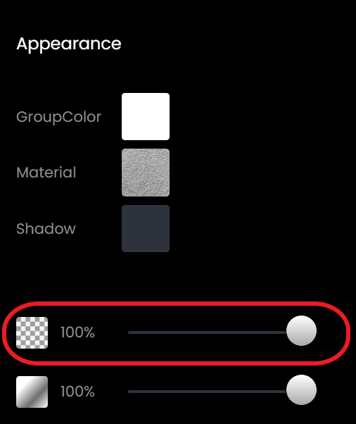

# 오브젝트 속성 설정하기

배치가 완료되었다면, 오브젝트의 속성을 설정하여 다양한 방식으로 월드를 연출할 수 있습니다.

오브젝트의 카테고리에 따라 변경 가능한 속성이 달라집니다.

### 1. 속성 메뉴 진입

설정을 원하는 오브젝트를 선택하고, 속성 버튼을 눌러 진입합니다.

<figure><figcaption>
Object Option
</figcaption></figure>

### 2. 속성 변경하기

속성을 원하는 대로 변경하여 다양하게 연출합니다.

#### Data

Data 탭에는 오브젝트의 정보가 나타납니다.

<figure><figcaption>
Data
</figcaption></figure>

* BodyType

3D Model에 형성될 물리적인 형태(Body)를 지정할 수 있습니다. 5가지 옵션이 존재하며 각각 다음과 같은 방식으로 생성됩니다.

Box : 3D Model 전체를 포함할 수 있는 가장 작은 형태의 직육면체 body를 생성합니다.

Sphere : 3D Model의 길이, 너비, 높이의 평균을 지름으로 하는 구 형태 body를 생성합니다.

Hull : 3D Model의 가장 바깥 정점들을 기반으로 body를 생성합니다.

Convex : 3D 모델의 모든 부분이 외부로 튀어나오거나 돌출되지 않는 형태의 body를 생성합니다.

Concave : 3D 모델의 일부분이 내부로 들어가거나 오목한 형태를 가지고 있는 body를 생성합니다.

&#x20;  &#x20;

* Script

박스를 클릭하여 체크하면, 해당 오브젝트를 활용한 스크립트 작성이 가능합니다.

#### Transform

<figure><figcaption>
Transform
</figcaption></figure>

Transform 탭에는 오브젝트의 위치, 회전 각도, 크기가 나타납니다.

원하는 값을 입력하여 정교한 설정이 가능합니다.

#### Appearance

오브젝트의 투명도 조절 및 그림자 여부 설정이 가능합니다.

<figure><figcaption>
Appearance
</figcaption></figure>

#### Behavior

* CanCollide : 오브젝트와 아바타의 충돌 가능 여부를 설정합니다. 충돌을 해제하면 아바타가 오브젝트를 통과합니다.
* Anchored : 오브젝트를 고정시킵니다.
* Audio : 오브젝트에 소리를 추가합니다.
* Shadow(Optional) : 오브젝트가 그림자를 드리울 수 있도록 합니다.

<figure><figcaption>
Behavior
</figcaption></figure>

#### Material (Mesh Only)

메쉬 오브젝트의 색상(MeshColor), 광택(Shiniess), 텍스쳐(Map) 설정 및 투명도(Opacity) 조절이 가능합니다.

<figure><figcaption>
Material
</figcaption></figure>

#### Emitter Property & Particle Property (Effect Only)

이펙트의 방출 형태(Preset), 속도(Radial Speed), 각도(Radial Degree) 등을 설정할 수 있습니다.

<figure><figcaption>
Emitter Property &#x26; Particle Property 
</figcaption></figure>

#### Particle Behavior (Effect Only)

이펙트의 색상(ColorStart, ColorEnd) 등 정교한 설정이 가능합니다.

.png>).png>)

####

#### Audio (Sound Only)

소리의 크기(Volume), 소리의 재생 시간(Duration), 반복 재생 여부(Loop), 소리가 들리는 범위(Positional) 등 사운드 오브젝트의 속성 설정이 가능합니다.

<figure><figcaption>
Audio
</figcaption></figure>

#### Portal (Spawn > Portal Only)

포탈 오브젝트에 닿은 아바타가 이동할 콘텐츠 주소를 입력할 수 있습니다.

<figure><figcaption>
Portal
</figcaption></figure>

레드브릭 랜드에 퍼블리싱 된 콘텐츠 URL 중, \[ pid= ] 뒤를 복사하여 Portal 탭의 pId 란에 입력합니다.


아래는 Runnerz 게임의 pId 값입니다.\
**2bcbe8d3-1aba-42ae-b92b-78b58dacaa8f**


<figure><figcaption>
URL &#x26; pId Address
</figcaption></figure>
