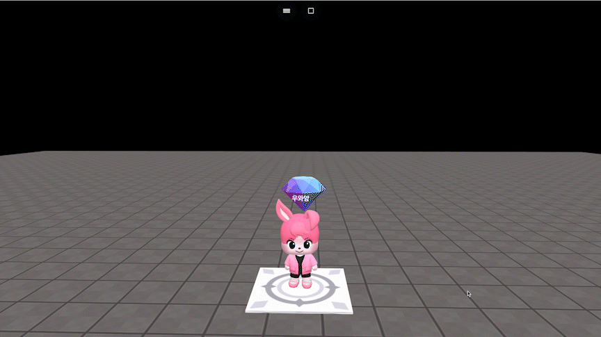

# object.changeAxisSpeed(x, y, z)

### 정의

> ### 지정한 각 축의 속도만큼 캐릭터가 축에 대해서 이동합니다.
>
> * 해당 명령어를 활용하여 순간 가속도를 연출할 수 있습니다.
> * 속도는 재설정하기 전까지 유지됩니다.
> * **x**\
>   x축 속도를 입력합니다.
> * **y**\
>   y축 속도를 입력합니다.
> * **z**\
>   z축 속도를 입력합니다.


### 예시

```javascript
const item = getObject("decoration_cutediamond_005(e48)")

function OnJoinPlayer(player) {
	item.onCollide(player, function() {
	    item.kill()
	    player.changeAxisSpeed(0, 0, -50)
	})
}
```

<figure><figcaption><p>싫행 결과</p></figcaption></figure>
