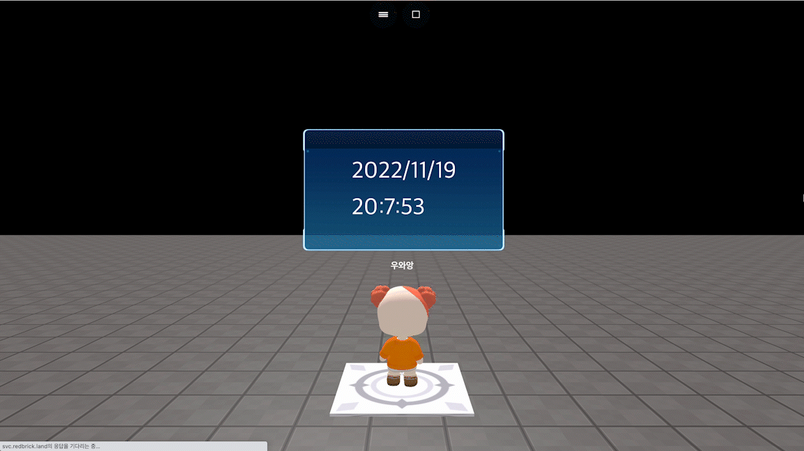

# getDay()

### 정의

> ### 현재 날을 정수로 반환합니다.
>
> * 게임이 실행되는 현재 일자의 날을 반환합니다.


### 예시

```javascript
const board = getObject("board_at_c(c78)")
onSecond(1, function() {
    board.setText(getYear()+"/"+getMonth()+"/"+getDay()+"\n"
    +getHour()+":"+getMinutes()+":"+getSeconds())
})
```

<figure><figcaption><p>실행 결과</p></figcaption></figure>
