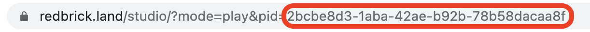

# changeScene(string)

### 정의

> ### 실행 시 특정 pId값을 가지는 play mode scene으로 이동합니다.&#x20;
>
> <mark style="color:red;">(주의) 멀티플레이 프로젝트에서는 동작하지 않습니다!</mark>
>
> *   **string**\
>     퍼블리싱된 프로젝트의 pId 값을 입력합니다.
>
>     <figure><figcaption></figcaption></figure>


### 예시

```javascript
onKeyDown("KeyZ", function() {
    changeScene("2bcbe8d3-1aba-42ae-b92b-78b58dacaa8f")
})
```

<figure><figcaption><p>실행 결과</p></figcaption></figure>
