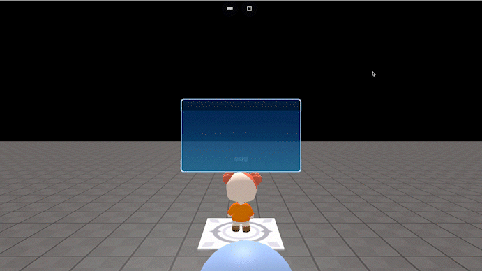

# hideAllGui()

### 정의

> ### 모든 GUI 요소를 한 번에 숨깁니다.
>
> * GUI 카테고리에 포함되는 모든 오브젝트를 숨깁니다.


### 예시

```javascript
onKeyDown("KeyX", function() {
    hideAllGui()
})
```

<figure><figcaption><p>실행 결과</p></figcaption></figure>
