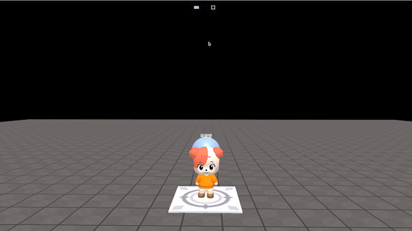

# onClickEmpty(callback)

### 정의

> ### 플레이 모드에서 isAlive상태가 아닌 요소(지면, 허공 등)를 클릭 시 콜백 함수를 실행합니다.
>
> * **callback(args)**\
>   클릭하면 실행될 코드를 입력합니다.


### 예시

```javascript
const sphere = getObject("SPHERE(cc6)")

onClickEmpty(function () {
    sphere.moveY(10, 1)
})

// multiplay example
onKeyEmpty(function(player) {
    // player는 event를 발생시킨 주체이며 doSomething은 예시 코드입니다.
    player.doSometing(
})
```

<figure><figcaption><p>실행 결과</p></figcaption></figure>
