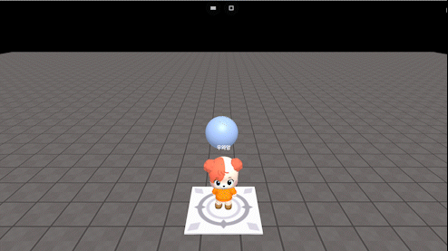

# onKeyUp(string, callback)

### 정의

> ### 특정 키를 떼는 이벤트에 콜백 함수를 실행합니다.
>
> * **string**\
>   Key\[key] 형태로 키를 입력합니다.\
>   아바타 기본 조작키 (w, a, s, d, space)는 사용하지 않습니다.
> * **callback(args)**\
>   키를 떼면 실행될 코드를 입력합니다.


### 예시

```javascript
const sphere = getObject("SPHERE(cc6)")
onKeyDown("KeyX", function() {
    sphere.moveX(1, 1)
})

onKeyUp("KeyX", function() {
    sphere.moveX(0, 1)
})

// multiplay example
onKeyUp("KeyM", function(player) {
    // player는 event를 발생시킨 주체이며 doSomething은 예시 코드입니다.
    player.doSometing(
})
```

<figure><figcaption><p>실행 결과</p></figcaption></figure>
