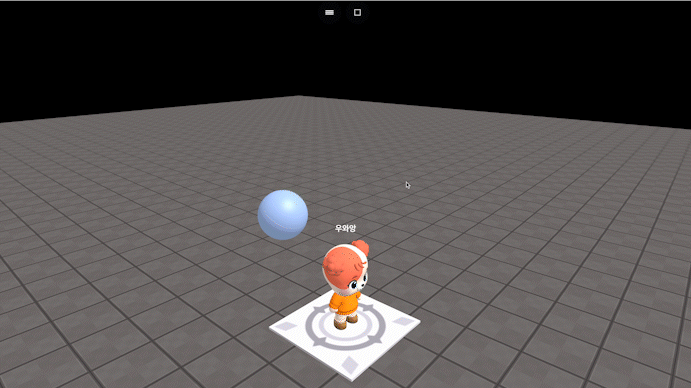

# onSecond(number, callback)

### 정의

> ### 지정한 시간마다 콜백 함수를 실행합니다.
>
> * **number**\
>   callback 함수의 실행 간격을 초단위로 입력합니다.
> * **callback**\
>   시간마다 실행될 코드를 입력합니다.

### 해제 / 재시작

var, let, const등의 변수 또는 상수에 onSecond를 할당하는 것으로 반복 중인 함수를 멈추거나 재시작 할 수 있습니다.


### 예시

```javascript
const sphere = getObject("SPHERE(cc6)")

const moveSphere = onSecond(2, function() {
    sphere.moveX(1, 1)
    sphere.moveX(-1, 1)
})

// stop repetition
moveSphere.stop()

// restart repetition
moveSphere.start()
```

<figure><figcaption><p>실행 결과</p></figcaption></figure>

### 해제 / 재시작

var, let, const등의 변수 또는 상수에 onSecond를 할당하는 것으로 반복중인 함수를 멈추거나 재시작 할 수 있습니다.

```javascript
const sphere = getObject("SPHERE(cc6)")

const moveSphere = onSecond(2, function() {
    sphere.moveX(1, 1)
    sphere.moveX(-1, 1)
})

// stop repetition
moveSphere.stop()

// restart repetition
moveSphere.start()
```
