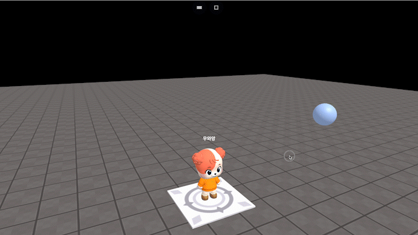

# wait(number)

### 정의

> ### 지정된 시간만큼 코드 실행을 유예합니다.
>
> * **number**\
>   코드 실행을 유예할 시간을 초단위로 입력합니다.


### 예시

```javascript
const sphere = getObject("SPHERE(cc6)")
wait(1)
sphere.goX(10)
wait(1)
sphere.goX(10)
```

<figure><figcaption><p>실행 결과</p></figcaption></figure>
