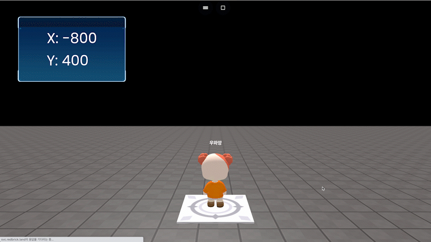

# sprite.getPosition(option)

### 정의

> ### GUI의 현재 위치값을 객체로 반환 {x, y}합니다.
>
>
>
> **object**
>
> *   array
>
>     포지션 정보를 가져올 player를 담는 배열입니다.


### 예시

```javascript
const board = getObject("board_at_c(c02)")

// singleplay project
function OnJoinPlayer(player) {
	onKeyDown("KeyZ", function() {
	    board.setPosition(-800, 400)
	    board.setText("X: " + board.getPosition().x 
	    + "\nY: "+ board.getPosition().y)
	})
	
	onKeyDown("KeyX", function() {
	    board.setPosition(800, 400)
	    board.setText("X: " + board.getPosition().x 
	    + "\nY: "+ board.getPosition().y)
	})
}

// multiplay project
function OnJoinPlayer(player) {
	onKeyDown("KeyZ", function(player) {
	    board.setPosition(-800, 400, {target: [player]})
	    board.setText("X: " + board.getPosition({target: [player]}).x 
	    + "\nY: "+ board.getPosition({target: [player]}).y, {target: [player]})
	})
	
	onKeyDown("KeyX", function(player) {
	    board.setPosition(800, 400, {target: [player]})
	    board.setText("X: " + board.getPosition({target: [player]}).x 
	    + "\nY: "+ board.getPosition({target: [player]}).y, {target: [player]})
	})
}
```

<figure><figcaption><p>실행 결과</p></figcaption></figure>
