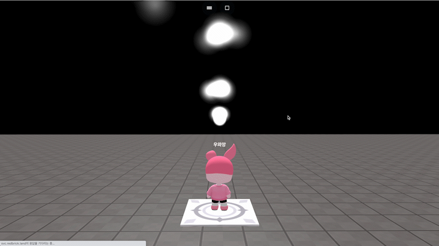

# object.stopEmit()

### 정의

> ### 파티클 오브젝트가 방출 중이라면 방출을 멈춥니다.


### 예시

```javascript
const particle = getObject("ParticleSystem(751)")
const tile = getObject("decoration_concretetile_001(624)")

tile.onCollide("player", function() {
    particle.stopEmit()
})
```

<figure><figcaption><p>실행 결과</p></figcaption></figure>
