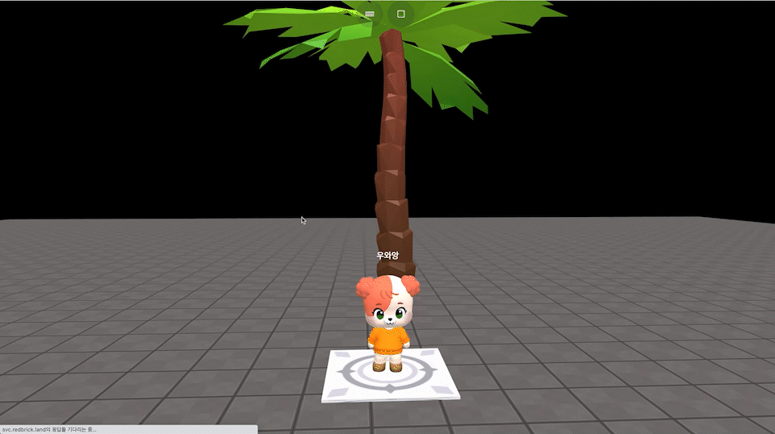
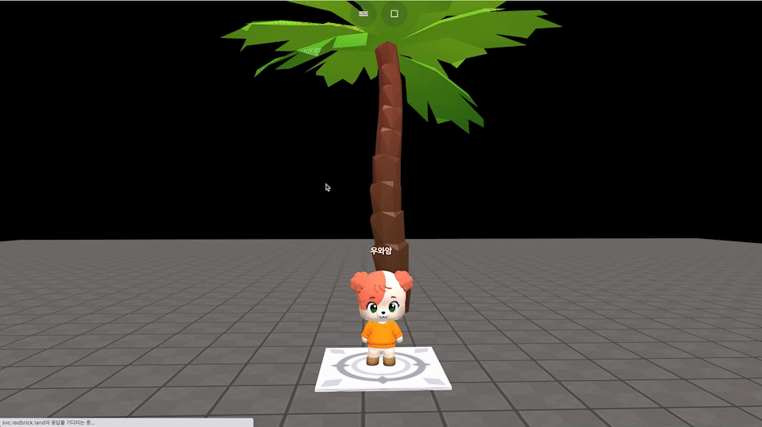

# object.setMovable(boolean)

### 정의

> ### 오브젝트의 물리엔진 적용 여부를 설정합니다.
>
> * 레드브릭 스튜디오는 기본적으로 물리엔진의 영향을 받습니다.
> *   **boolean**
>
>     true : 물리엔진의 영향을 받습니다.
>
>     false : 물리엔진의 영향을 받지 않습니다.


### 예시

```javascript
const tree = getObject("nature_palmtree_001(cdf)")
function Setup() {
    tree.setMovable(true)
}
```

<figure><figcaption><p>setMovable(true) 실행 결과</p></figcaption></figure>


```javascript
const tree = getObject("nature_palmtree_001(cdf)")
function Setup() {
    tree.setMovable(false)
}
```

<figure><figcaption><p>setMovable(false) 실행 결과</p></figcaption></figure>
