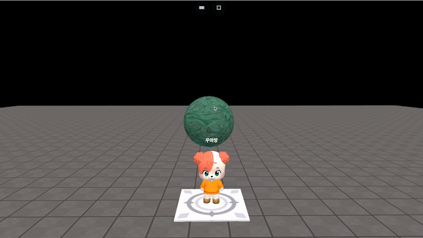

# object.setTextureOffset(number, number)

### 정의

> ### 오브젝트에 적용된 텍스쳐가 있다면 텍스쳐의 오프셋을 지정된 값으로 변경합니다.
>
> * Mesh 오브젝트에는 [텍스쳐](../../../create-world/undefined-2.md#material-mesh-only)를 설정할 수 있습니다.
> * 옵션 설정 메뉴에서 직접 오프셋 변경도 가능하며, 코드 작성을 통해서도 가능합니다.
> * **number**\
>   0\~1 사이의 값


### 예시

```javascript
const sphere = getObject("SPHERE(4d9)")

sphere.onClick(function() {
    sphere.setTextureOffset(getRandom(1, 9)/10, getRandom(1, 9)/10)
})
```

<figure><figcaption><p>실행 결과</p></figcaption></figure>
