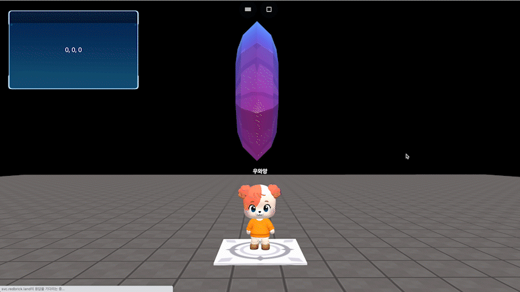

# object.getRotation()

### 정의

> ### 오브젝트의 rotation값을 객체로 반환 {x, y, z}합니다.


### 예시

```javascript
const dia = getObject("decoration_cutediamond_001(64f)")
const board = getObject("board_at_c(9c9)")

board.setText(dia.getRotation().x+", "+dia.getRotation().y+", "+dia.getRotation().z)

onKeyDown("KeyZ", function() {
    dia.rotateY(90)
    board.setText(dia.getRotation().x+", "+dia.getRotation().y+", "+dia.getRotation().z)
})
```

<figure><figcaption><p>실행 결과</p></figcaption></figure>
