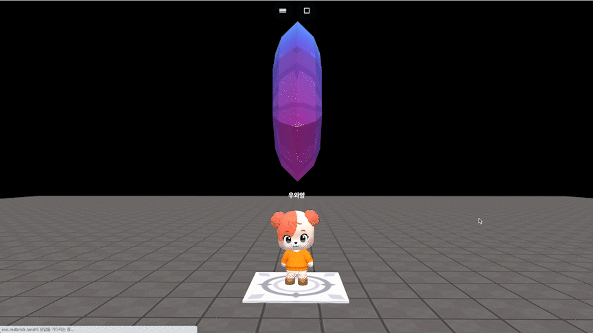

# object.rotateY(dy)

### 정의

> ### 오브젝트를 y축으로 지정한 만큼 바로 회전합니다.
>
> * **dy**\
>   y축 회전량을 입력합니다.


### 예시

```javascript
const dia = getObject("decoration_cutediamond_001(64f)")

onKeyDown("KeyZ", function() {
    dia.rotateY(90)
})
```

<figure><figcaption><p>실행 결과</p></figcaption></figure>
