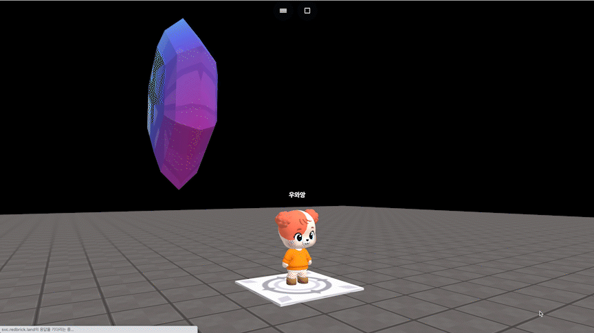

# object.turnX(dx, speed)

### 정의

> ### 오브젝트를 x축으로 지정한 속도로 지정한 각도만큼 회전합니다.
>
> * **dx**\
>   x축 회전량을 입력합니다.
> * **speed**\
>   회전 속도를 입력합니다.


### 예시

```javascript
const dia = getObject("decoration_cutediamond_001(64f)")

onKeyDown("KeyZ", function() {
    dia.turnX(90, 90)
})
```

<figure><figcaption><p>실행 결과</p></figcaption></figure>
