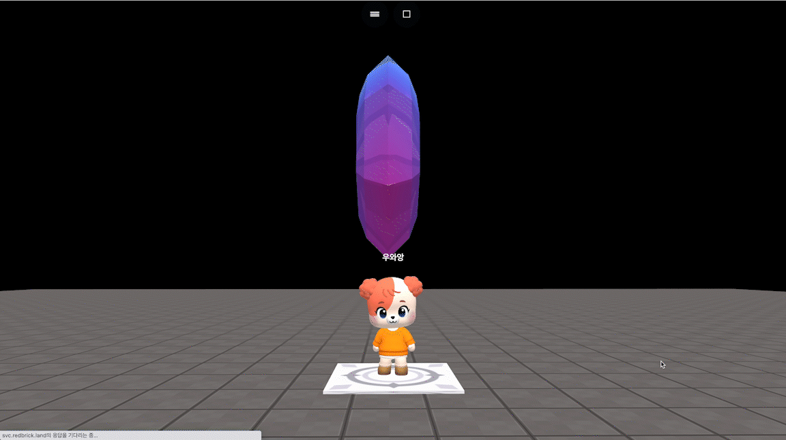

# object.turnZ(dz, speed)

### 정의

> ### 오브젝트를 z축으로 지정한 속도로 지정한 각도만큼 회전합니다.
>
> * **dz**\
>   z축 회전량을 입력합니다.
> * **speed**\
>   회전 속도를 입력합니다.


### 예시

```javascript
const dia = getObject("decoration_cutediamond_001(64f)")

onKeyDown("KeyZ", function() {
    dia.turnZ(90, 90)
})
```

<figure><figcaption><p>실행 결과</p></figcaption></figure>
