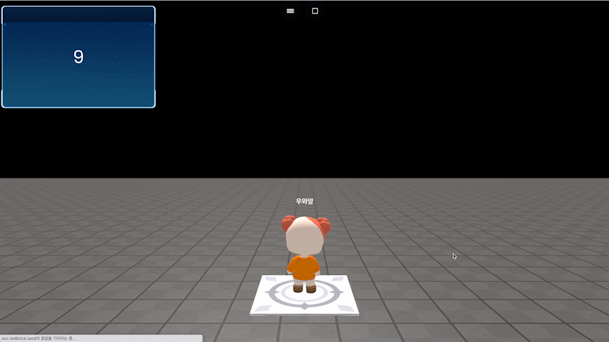

# getTimer()

### 정의

> ### 호출 시 현재 타이머의 시간을 반환합니다.
>
> * 초(second) 기준의 타이머를 반환합니다.


### 예시

```javascript
const board = getObject("board_at_c(c78)")

function OnJoinPlayer(player) {
    startTimer()
    onSecond(1, function() {
        board.setText(floor(getTimer()), {target: [player]})
    })
}
```

<figure><figcaption><p>실행 결과</p></figcaption></figure>

