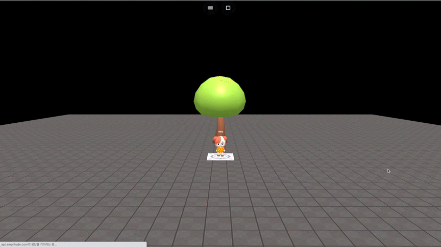

# object.goTo(x, y, z)

### 정의

> ### 지정한 좌표로 오브젝트를 바로 이동합니다.
>
> * **x**\
>   x축 좌표를 입력합니다.
> * **y**\
>   y축 좌표를 입력합니다.
> * **z**\
>   z축 좌표를 입력합니다.


### 예시

```javascript
const tree = getObject("nature_minitree1_006(e3c)")

onKeyDown("KeyZ", function() {
    tree.goTo(20, 8, -3)
})
```

<figure><figcaption><p>실행 결과</p></figcaption></figure>
