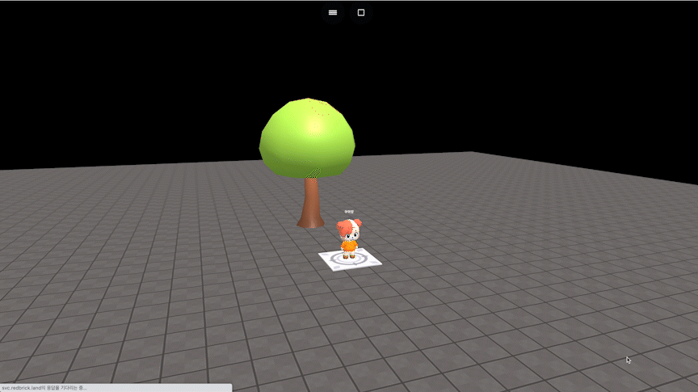

# object.goX(dx)

### 정의

> ### 오브젝트를 x축으로 지정한 만큼 바로 이동합니다.
>
> * **dx**\
>   x축 이동량을 입력합니다.


### 예시

```javascript
const tree = getObject("nature_minitree1_006(e3c)")

onKeyDown("KeyZ", function() {
    tree.goX(30)
})
```

<figure><figcaption><p>실행 결과</p></figcaption></figure>
