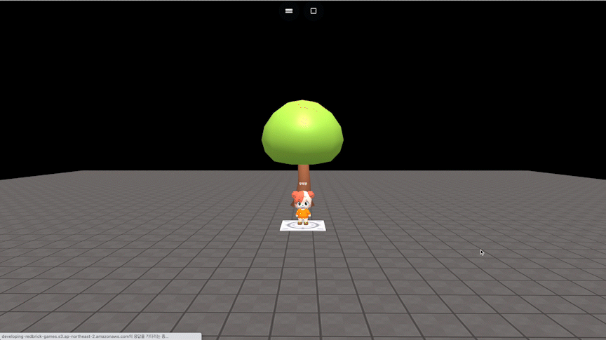

# object.moveZ(dz, speed)

### 정의

> ### 오브젝트를 z축으로 지정한 속도로 지정한 거리만큼 이동합니다.
>
> * **dz**\
>   x축 이동량을 입력합니다.
> * **speed**\
>   이동 속도를 입력합니다.\
>   값이 클 수록 빨리 움직입니다.


### 예시

```javascript
const tree = getObject("nature_minitree1_006(e3c)")

onKeyDown("KeyZ", function() {
    tree.moveZ(20, 20)
})
```

<figure><figcaption><p>실행 결과</p></figcaption></figure>
