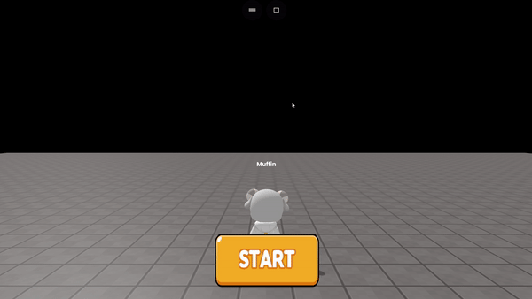

# 게임 시작 버튼 만들기

### 1. 원하는 start버튼 선택&#x20;

왼쪽 위에 + 버튼 클릭 -> GUI 클릭 -> 원하는 start버튼 선택&#x20;

<figure><figcaption><p>시작 버튼 선택</p></figcaption></figure>

### 2. 코드 입력하기&#x20;

#### 예시

```javascript
const startbtn = getObject("casual_a_button_d(dc0)")

function Setup () {
    startbtn.onClick(function() {
    startbtn.hide()
})
}
```

<figure><figcaption><p>실행화면</p></figcaption></figure>
