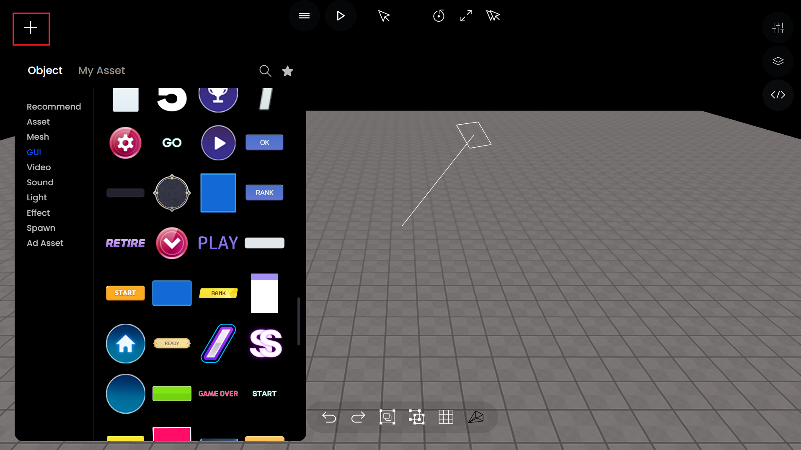
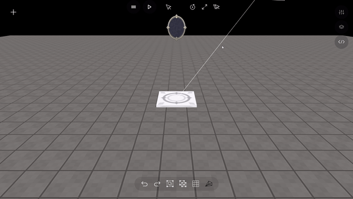
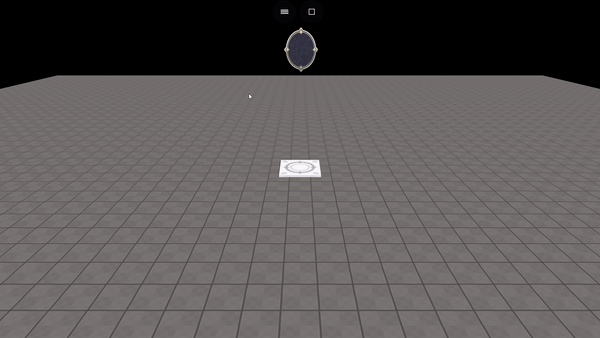

# 타이머, 카운트다운 만들기

### 1. 원하는 GUI 선택&#x20;

타이머, 카운트다운을 보여 줄 GUI 선택한다.

<figure><figcaption><p>타이머, 카운트다운 GUI 선택</p></figcaption></figure>

### 2. 코드 입력하기

#### 타이머 예시&#x20;

```javascript
let count = 0;
const countboard = getObject("startBD")
const startCount = setInterval(() => {
        count++;
        countboard.setText(count, true)
    }, 1000)
```

<figure><figcaption><p>실행화면</p></figcaption></figure>

#### 카운트다운 예시

```javascript
let count = 100;
const countboard = getObject("startBD")
const startcount = setInterval(() => {
    count --;
    countboard.setText(count, true) 
}, 1000)
```

<figure><figcaption><p>실행화면</p></figcaption></figure>

