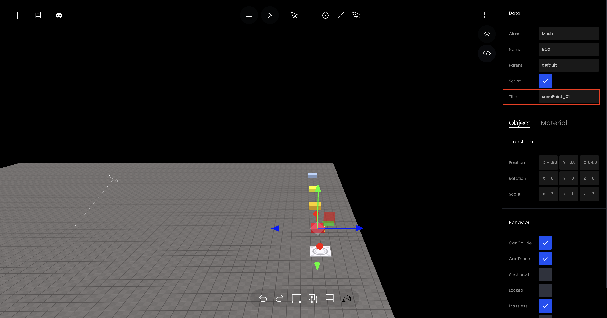

# 세이브 포인트 만들기

### 1. 원하는 곳에 SavePoint 놓기&#x20;

원하는 곳에 SavePoint를 놓은 후 Title명을 변경해줍니다.

<figure><figcaption><p>세이브 포인트 놓기</p></figcaption></figure>

### 2. 원하는 곳에 StartLocation 놓기

시작지점에 StartLocation을 놓습니다.

<figure><figcaption><p>StartLocation 놓기</p></figcaption></figure>

### 3. 코드 입력하기

#### 예시

```javascript
const limit = { y : -5 }
let player = getObject("player")
let startLocation = getObject("StartLocation(c9a)");
const savePoint = [];
for(let i = 0; i < 4; i++)
{
    savePoint[i] = getObject("savePoint_0" + (i+1));
    savePoint[i].onCollide(player, function() {
        let posx = savePoint[i].getPosition().x;
        let posy = savePoint[i].getPosition().y;
        let posz = savePoint[i].getPosition().z;
        
        startLocation.goTo(posx, posy - 1 ,posz);
    })
}

setInterval(()=> {
        const pos = player.getPosition()
        if(pos.y < limit.y) {
            player.spawn(startLocation)
        }
})
```

<figure><figcaption><p>실행화면</p></figcaption></figure>
