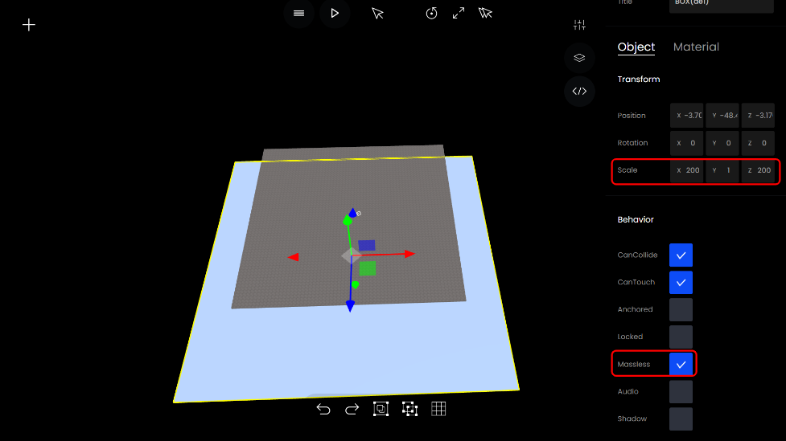
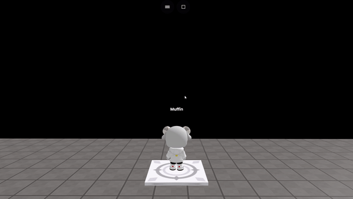

# 떨어졌을 때 원래 위치로 돌아오기

### 1. 원하는 곳에 오브젝트 놓기&#x20;


mesh가 아닌 다른 오브젝트를 해도 가능합니다.


원하는 곳에 mesh를 깔아놓은 후 크기와 Massless를 조절합니다.

<figure><figcaption><p>사이즈 및 Massless</p></figcaption></figure>

### 2. mesh 투명화 하기&#x20;

오른쪽 밑에 있는 Opacity를 이용해 투명도를 조절합니다.

<figure><figcaption><p>투명도 조절</p></figcaption></figure>

### 3. 원래 위치로 돌아올 장소 만들기

왼쪽 위에 있는 + 버튼을 클릭 -> Spawn 클릭 -> 두번째에 있는 StartLocation을 클릭합니다.

<figure><figcaption><p>스폰지역 찾기</p></figcaption></figure>

StartLocation을 원하는 위치로 옮깁니다.

<figure><figcaption><p>스폰지역 정하기</p></figcaption></figure>

### 4. 코드 입력하기

#### 예시

```javascript
 let player = getObject("player");
 const spawnbox = getObject("BOX(de1)")
 spawnbox.onCollide(player, function() {
        player.spawn()
    })
```

#### 예시 2

```javascript
let player = getObject("player");
const spawnbox = getObject("BOX(de1)")
spawnbox.onContact(player, function() {
        player.spawn()
})
```

<figure><figcaption><p>실행화면</p></figcaption></figure>

